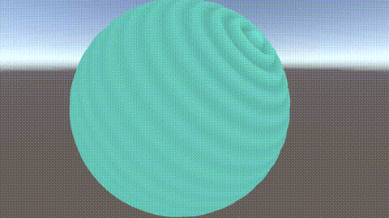
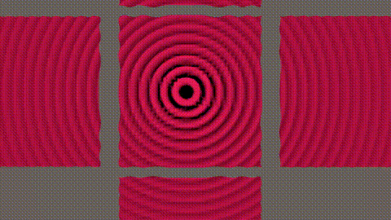
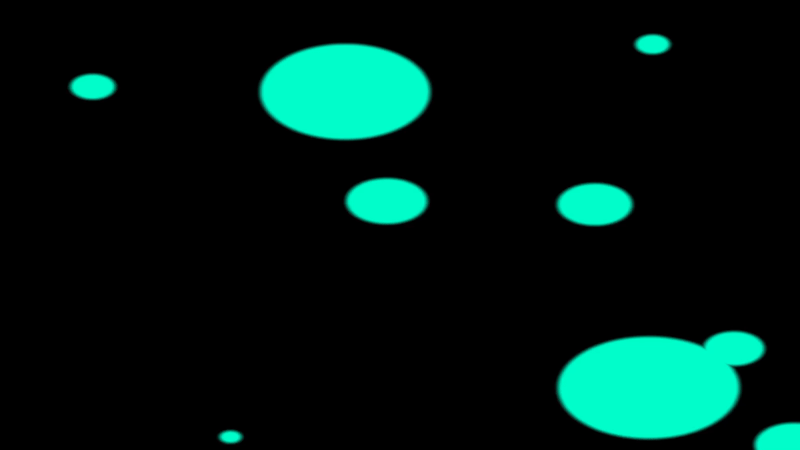

# Shader Workshop: Unity (HLSL) & ModernGL (GLSL)

The goal of this project was the creation of a **water shader** in Unity using HLSL.  
The water shader combines vertex displacement with multiple sine waves and depth-based foam effects.  

The shaders presented below (object-space ripple, world-space ripple, screen-position, depth) represent preliminary experiments.  
They were used to explore different concepts such as coordinate spaces, vertex displacement, and depth textures, and provided the groundwork for the final water shader.

## Table of Contents
- [Shader Workshop: Unity (HLSL) \& ModernGL (GLSL)](#shader-workshop-unity-hlsl--moderngl-glsl)
  - [Table of Contents](#table-of-contents)
    - [Tools and Research](#tools-and-research)
    - [Water Shader](#water-shader)
        - [Vertex-Shader Basic Concept](#vertex-shader-basic-concept)
        - [Fragment-Shader Texture](#fragment-shader-texture)
        - [Foam using Camera Depth Texture](#foam-using-camera-depth-texture)
    - [Vertex-Shaders](#vertex-shaders)
      - [Object-Space Ripple](#object-space-ripple)
      - [World-Space Ripple](#world-space-ripple)
    - [Fragement-Shaders](#fragement-shaders)
      - [Screen-Position Shader](#screen-position-shader)
      - [Camera-Depth Shader](#camera-depth-shader)
    - [Shader Demos ModernGL](#shader-demos-moderngl)
    - [Bonus: Generating Gifs from mp4/mkv... using ffmpeg](#bonus-generating-gifs-from-mp4mkv-using-ffmpeg)

---
### Tools and Research
- [Geogebra](https://www.geogebra.org/u/schlachsahne76) – formulas i used to understand shader-logic
- [Free Unity Textures](https://ambientcg.com/list?sort=popular) – material and test textures   
- [Water Textures](https://www.manytextures.com/) 
- [Shader Distance Functions](https://iquilezles.org/articles/distfunctions2d/) – mathematical references  

---
### Water Shader

**Shader:** `Waves.shader` 


##### Vertex-Shader Basic Concept

The water surface is displaced by combining several sine functions.  
Each sine controls an oscillation in a different spatial direction or pattern (radial, diagonal, noisy, etc.).  
The resulting value modifies the vertex position along the surface normal.


\[
W(x, z, t) = \sum_{i=1}^{N} A_i \cdot \sin\!\big( g_i(x, z)\cdot f_i  - \omega_i t + \varphi_i\big)
\]

- \(A_i\) amplitude controlling the wave height  
- \(g_i(x, z)\) spatial function such as a distance, a projection, or a simple axis 
- \(f_i\) spatial frequency controlling the number of waves (inverse of wavelength)  
- \(\omega_i\) temporal frequency controlling wave speed 
- \(t\) global time provided by Unity
- \(\varphi_i\) phase offset, optionally random for noise  

The displaced vertex is computed as

\[
p' = p + n \cdot W(x,z,t)
\]

- \(p'\) displaced world position of the vertex  
- \(p\) original world position of the vertex  
- \(n\) world-space normal of the vertex  
- \(W(x,z,t)\) wave function evaluated at the vertex position and global time  

On a flat plane mesh (with normals pointing upwards) this means a vertical displacement, while on curved meshes the displacement follows the local surface normals.
 
This formulation allows mixing multiple sine waves to create more natural and complex wave interference patterns.

##### Fragment-Shader Texture
In the fragment stage the base texture is sampled with UV coordinates that are slightly shifted over time.  
This creates the effect of a scrolling surface pattern, making the water look more dynamic. 
The time factor `_TextureSpeed` controls the scrolling speed.

##### Foam using Camera Depth Texture

Unity provides a built-in **camera depth texture**, which stores for each pixel the distance from the camera to the closest visible surface.  
In the fragment shader this texture can be sampled using the screen-space UV coordinates of the current pixel.  
By comparing this **scene depth** with the depth of the water surface fragment itself, one can detect intersections where both values are nearly identical.  
This mechanism is used to generate the foam mask along contact edges between water and solid geometry.


---

### Vertex-Shaders
#### Object-Space Ripple  




**Shader:** `SphereRipple.hlsl`  
Waves are calculated in **object space**, making the ripple effect stick to the object itself. Useful for spherical effects such as ripples on a small planet or sphere.  

---

#### World-Space Ripple  


**Shader:** `UniversalRipple.hlsl`  
Waves are calculated in **world space** with a fixed wave center. The effect is independent of object movement, suitable for environmental or global ripple effects.  

---
### Fragement-Shaders
#### Screen-Position Shader
coming soon
**Shader:** `PositionShader.shader` 

---

#### Camera-Depth Shader
coming soon
**Shader:** `DepthShader.shader` 


---
### Shader Demos ModernGL


**Shader:** `moderngl/bubbles.py`  
Bubble sizes and positions are calculated by the CPU and then drawn onto the screen.

---

### Bonus: Generating Gifs from mp4/mkv... using ffmpeg
```bash
ffmpeg -i input.mp4-vf "fps=15,scale=400:-1:flags=lanczos,palettegen" palette.png
ffmpeg -ss 0 -t 5 -i input.mp4 -i palette.png -filter_complex "fps=15,scale=400:-1:flags=lanczos[x];[x][1:v]paletteuse" output.gif
```
